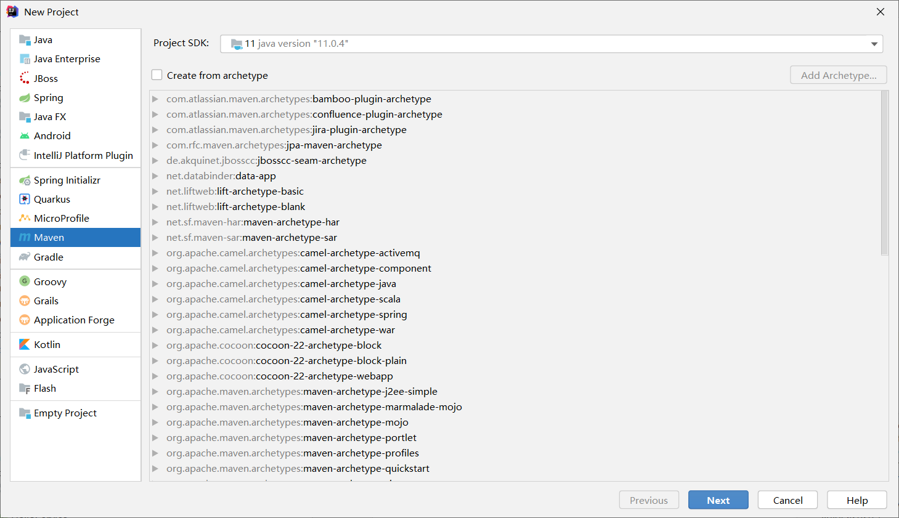
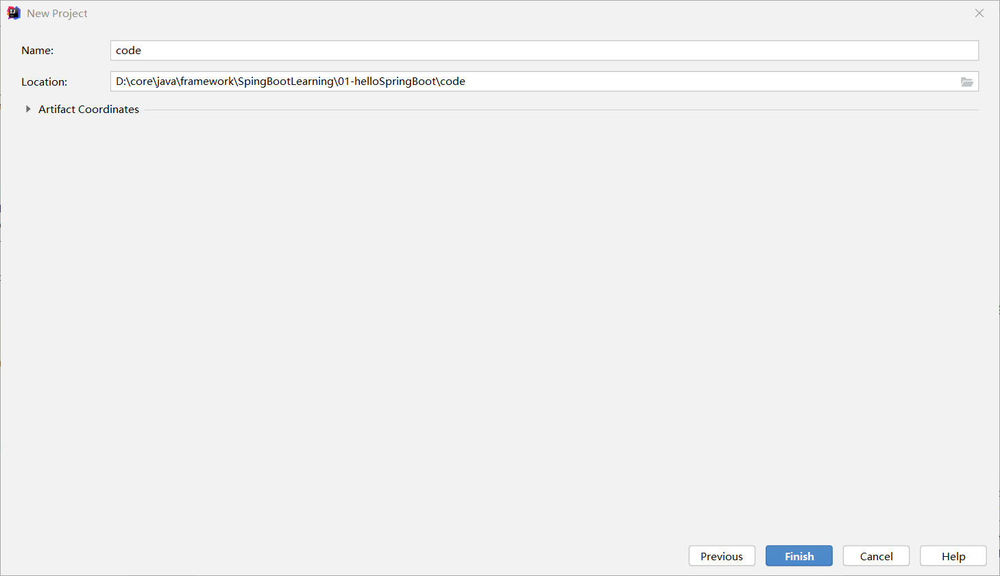
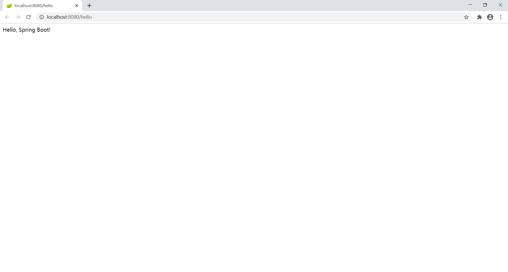

# 实现步骤

## 创建工程

#### 

## 添加依赖

### [pom.xml](code/pom.xml)

## 创建启动类

### [Application.java](code/src/main/java/com/xuan/Application.java)

 * spring boot 工程都有一个启动引导类，这是工程的入口类
 * 在引导类上添加`@SpringBootApplication`项目会自动扫描这个类下的包

## 创建处理器 Controller

### [HelloController.java](code/src/main/java/com/xuan/controller/HelloController.java)

- `@RestController`：返回json数据，相当于@Controller+@ResponseBody两个注解的结合
- `@GetMapping`：映射请求方法为GET类型的 url 到控制器类的一个特定处理程序方法

# 测试

点击运行后访问 http://localhost:8080/hello

