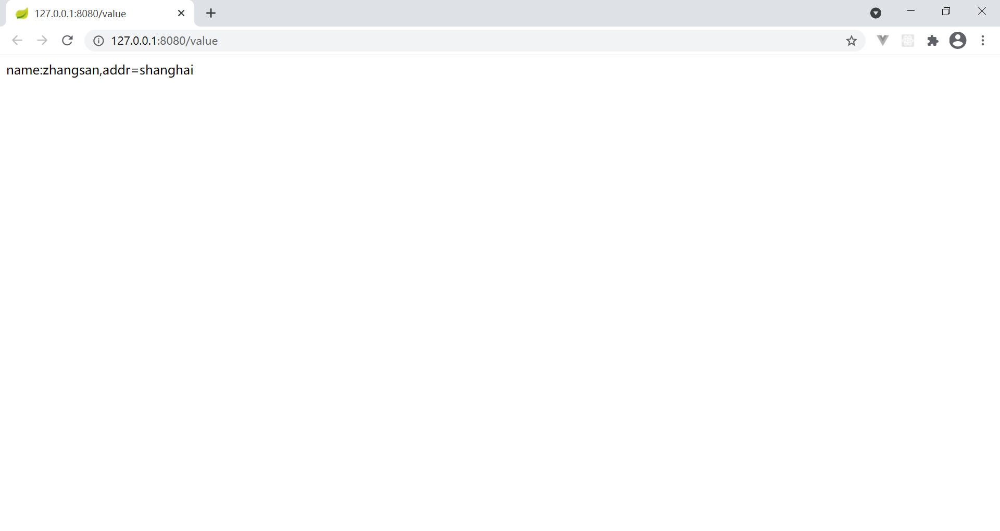

# 实现步骤

## 创建工程

1. 创建 maven 工程
2. 导坐标：[pom.xml](code/pom.xml)
3. 启动类：[Application.java](code\src\main\java\com\xuan\Application.java)

## 编写配置文件

[application.yml](code\src\main\resources\application.yml)

## 读取配置文件

[ValueController.java](code\src\main\java\com\xuan\controller\ValueController.java)

使用 `@Value("${name}")` 注入 [application.yml](code\src\main\resources\application.yml) 中的 `name` 属性

## 测试

