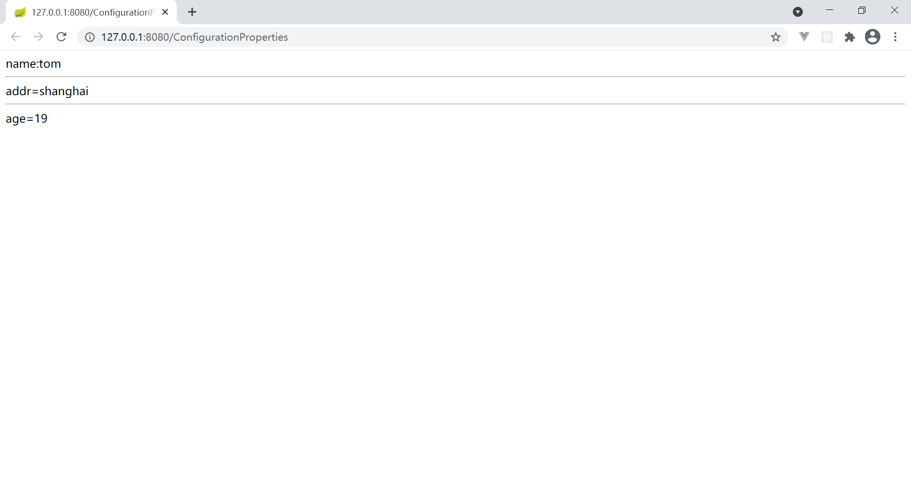

# 实现步骤

## 创建工程

1. 创建 maven 工程
2. 导坐标：[pom.xml](code/pom.xml)
3. 启动类：[Application.java](code\src\main\java\com\xuan\Application.java)

## 编写配置文件

[application.yml](code\src\main\resources\application.yml)

## 读取配置文件

[ConfigurationPropertiesController.java](code/src/main/java/com/xuan/controller/ConfigurationPropertiesController.java)

使用 `@ConfigurationProperties(prefix = "person")` 注入 [application.yml](code\src\main\resources\application.yml) 中的 `person` 的属性，记得创建 `set` 方法，因为 @ConfigurationProperties 是根据 set 方法注入的

## 测试

