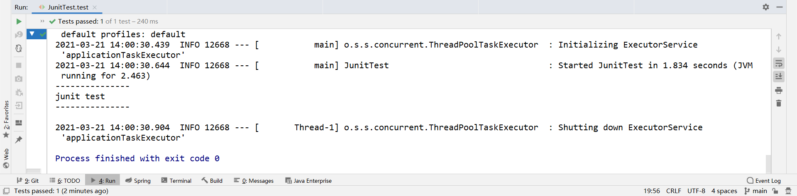

# 实现步骤

## 创建工程

1. 创建 maven 工程

2. 导坐标：[pom.xml](code/pom.xml)

   - springboot 坐标（略）

   - junit

   ```xml
   <!--SpingBoot集成junit测试的起步依赖-->
   <dependency>
      <groupId>org.springframework.boot</groupId>
      <artifactId>spring-boot-starter-test</artifactId>
      <scope>test</scope>
   </dependency>
   ```

3. 启动类：[Application.java](code\src\main\java\com\xuan\Application.java) 

## 编写测试类

 [JunitTest.java](code\src\test\java\JunitTest.java) 

## 测试




