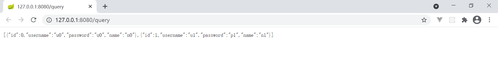

# 实现步骤

## 创建工程

1. 创建 maven 工程

2. 导坐标：[pom.xml](code/pom.xml)

   - spingboot 坐标( 略)

   - 添加Mybatis的起步依赖

     ```xml
     <!--mybatis起步依赖-->
     <dependency>
         <groupId>org.mybatis.spring.boot</groupId>
         <artifactId>mybatis-spring-boot-starter</artifactId>
         <version>1.1.1</version>
     </dependency>
     ```

   - 添加数据库驱动坐标

     ```xml
     <!-- MySQL连接驱动 -->
     <dependency>
         <groupId>mysql</groupId>
         <artifactId>mysql-connector-java</artifactId>
     </dependency>
     ```


3. 启动类：[Application.java](code\src\main\java\com\xuan\Application.java)

## 创建 user 实体类

 [User.java](code\src\main\java\com\xuan\domain\User.java) 

## 创建数据库

 [test.sql](data\test.sql) 

具体信息见 **[application.properties](code\src\main\resources\application.properties).数据库连接信息**

## 创建 mapper

 [UserMapper.xml](code\src\main\resources\mapper\UserMapper.xml) 

 [UserMapper.java](code\src\main\java\com\xuan\mapper\UserMapper.java) 

## 配置数据库连接信息

 [application.properties](code\src\main\resources\application.properties) 

## 编写Controller

 [MybatisController.java](code\src\main\java\com\xuan\controller\MybatisController.java) 

## 测试



