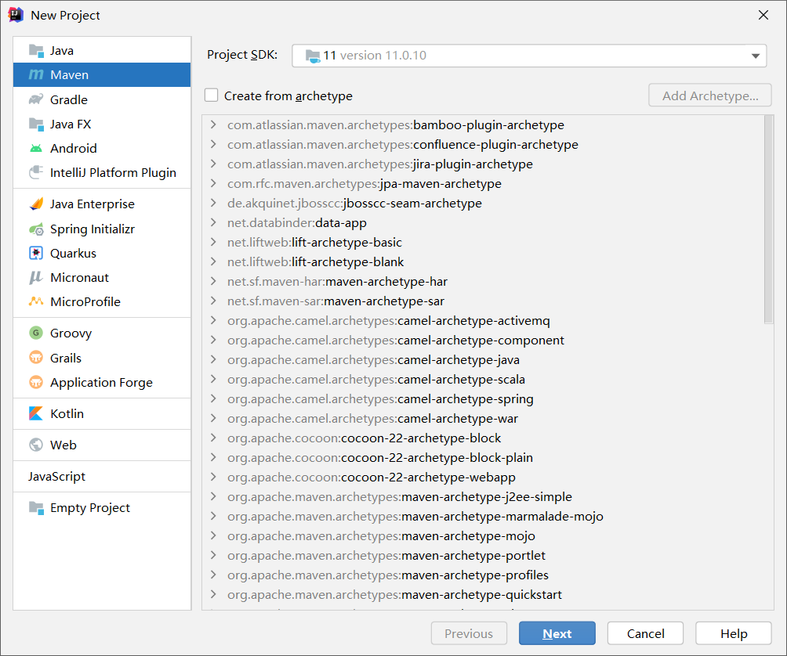
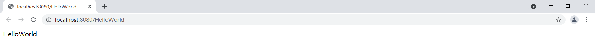

# 概述

本项目为 spring boot 的 HelloWorld 项目，主要目的是测试环境，效果见 [测试](#测试) 

# 环境

- jdk-11.0.10：[下载页面](https://www.oracle.com/java/technologies/javase/jdk11-archive-downloads.html) | [jdk-11.0.10_windows-x64_bin.exe](https://www.oracle.com/webapps/redirect/signon?nexturl=https://download.oracle.com/otn/java/jdk/11.0.10%2B8/020c4a6d33b74f6a9d2bc6fbf189da81/jdk-11.0.10_windows-x64_bin.exe) 
- maven-3.6.3：[下载页面](https://archive.apache.org/dist/maven/maven-3/) | [apache-maven-3.6.3-bin.zip](https://archive.apache.org/dist/maven/maven-3/3.6.3/binaries/apache-maven-3.6.3-bin.zip) 
- ideaIU-2021.1.2：[下载页面](https://www.jetbrains.com/idea/download/#section=windows) | [ideaIU-2021.1.2.exe](https://download.jetbrains.com.cn/idea/ideaIU-2021.1.2.exe) | [ideaIU-2021.1.2.tar.gz](https://download.jetbrains.com/idea/ideaIU-2021.1.2.tar.gz) 

# 步骤

## 创建 maven 项目

打开IDEA，菜单栏中选择：File → New → Project...



##  [pom.xml](demo\pom.xml) 

### 2.3.2.RELEASE

spring boot 中，版本非常重要，这里选择的版本是： **2.3.2.RELEASE** 

```xml
<parent>
    <groupId>org.springframework.boot</groupId>
    <artifactId>spring-boot-starter-parent</artifactId>
    <version>2.3.2.RELEASE</version>
    <relativePath/> <!-- lookup parent from repository -->
</parent>
```

### spring-boot-starter-web

导入 web 场景，这是使用 spring boot 开发 web 应用的关键

```xml
    <dependency>
        <groupId>org.springframework.boot</groupId>
        <artifactId>spring-boot-starter-web</artifactId>
    </dependency>
```

##  [DemoApplication.java](demo\src\main\java\com\example\demo\DemoApplication.java) 

```java
@SpringBootApplication
public class DemoApplication {

    public static void main(String[] args) {
        SpringApplication.run(DemoApplication.class, args);
    }

}
```

这是spring boot 的启动类。我认为，对于一个新手来说，关于启动类，只需要知道以下几点：

1. 此类是程序的入口
2. `@SpringBootApplication` 是Sprnig Boot 项目的核心注解，目的是开启自动配置
3. spring boot 包扫描的根路径默认为启动类所在路径。在本例中，`DemoApplication.java` 所在路径为 **src\main\java\com\example\demo\DemoApplication.java** ，则包扫描路径根路径为**src\main\java\com\example\demo** ，也就是说，**src\main\java\com\example\demo** 下的组件会被扫描，从而得以加入容器。如果组件不在包扫描路径下，比如有一组件 A 在 **src\main\java\com\A.java** ，则 A 组件不会加入容器中，A 组件的功能也就不会生效

##  [HelloWorldController.java](demo\src\main\java\com\example\demo\controller\HelloWorldController.java) 

```java
@RestController
public class HelloWorldController {

    @RequestMapping("HelloWorld")
    public String helloWorld() {
        return "HelloWorld";
    }

}
```

本类编写了一个 HTTP 接口，使其能够接受 HTTP 请求并向访问者返回字符串：

1. @RestController： [@RestController](assets\references\RestController (Spring Framework 5.2.8.RELEASE API).html) =  [@Controller](assets\references\Controller (Spring Framework 5.2.8.RELEASE API).html) + [@ResponseBody](assets\references\ResponseBody (Spring Framework 5.2.8.RELEASE API).html)  。它接受 HTTP 请求，并在 response body 中返回字符串给访问者
2. @RequestMapping：[@RequestMapping](assets\references\RequestMapping (Spring Framework 5.2.8.RELEASE API).html)  将web请求映射到请求处理类中。在本例中， http://localhost:8080/HelloWorld 映射到了 `HelloWorldController.helloWorld()`  

# 测试

1. 到 [DemoApplication.java](demo\src\main\java\com\example\demo\DemoApplication.java) 中启动 spring boot 项目
2. 访问 http://localhost:8080/HelloWorld 

访问结果如下所示：




