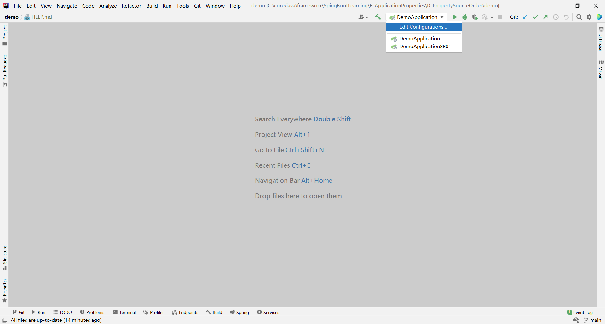
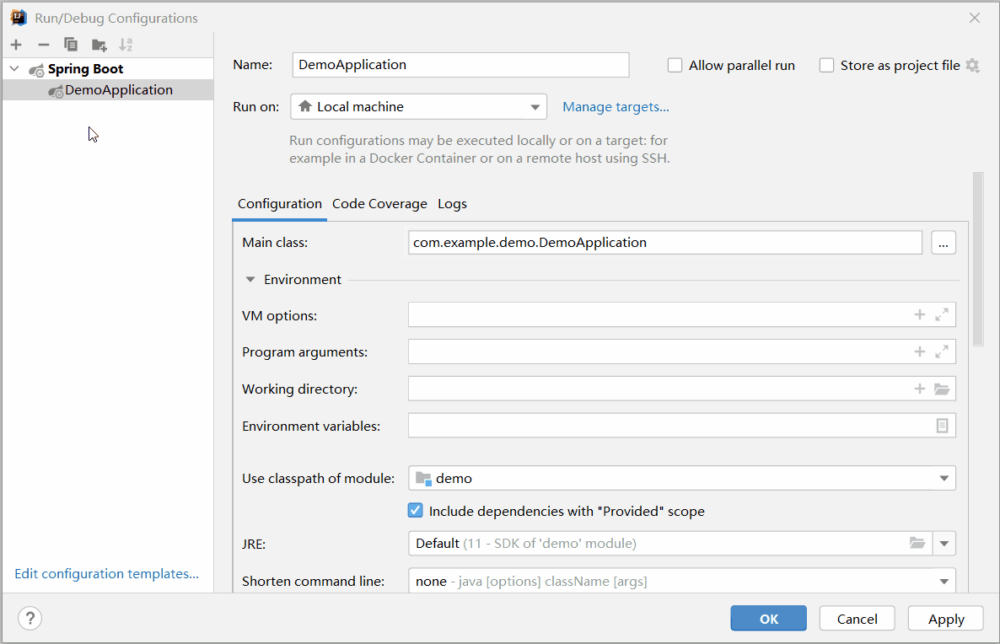
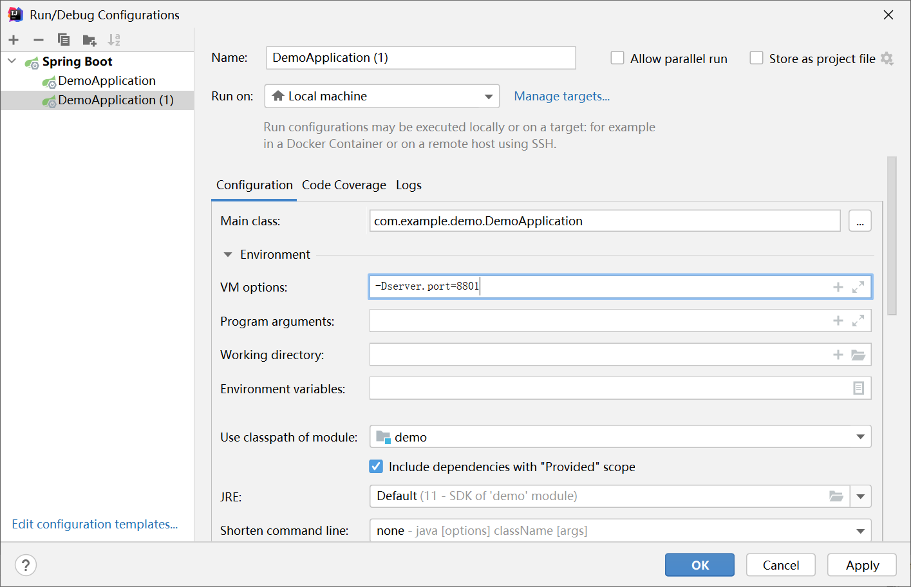
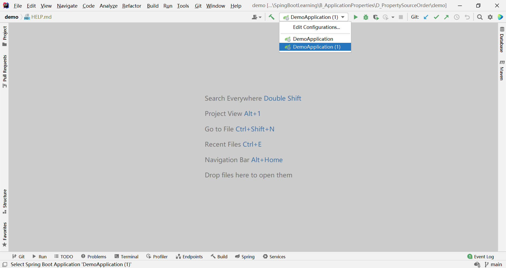

# 引言

spring boot  **properties** 的来源很多，优先级高的会覆盖优先级低的，他们的优先级如下：

> #####  [Spring Boot Features->2.Externalized Configuration](assets\Spring Boot Features.html#boot-features-external-config)  
>
> Spring Boot lets you externalize your configuration so that you can  work with the same application code in different environments. You can use properties files, YAML files, environment variables, and  command-line arguments to externalize configuration. Property values can be injected directly into your beans by using the `@Value` annotation, accessed through Spring’s `Environment` abstraction, or be [bound to structured objects](file:///C:/core/java/framework/SpingBootLearning/B_ApplicationProperties/D_PropertySourceOrder/assets/Spring Boot Features.html#boot-features-external-config-typesafe-configuration-properties) through `@ConfigurationProperties`.
>
> Spring Boot uses a very particular `PropertySource` order that is designed to allow sensible overriding of values. Properties are considered in the following order:
>
> 1. [Devtools global settings properties](https://docs.spring.io/spring-boot/docs/2.3.2.RELEASE/reference/html/using-spring-boot.html#using-boot-devtools-globalsettings) in the `$HOME/.config/spring-boot` directory when devtools is active.
> 2. [`@TestPropertySource`](https://docs.spring.io/spring/docs/5.2.8.RELEASE/javadoc-api/org/springframework/test/context/TestPropertySource.html) annotations on your tests.
> 3. `properties` attribute on your tests. Available on [`@SpringBootTest`](https://docs.spring.io/spring-boot/docs/2.3.2.RELEASE/api/org/springframework/boot/test/context/SpringBootTest.html) and the [test annotations for testing a particular slice of your application](file:///C:/core/java/framework/SpingBootLearning/B_ApplicationProperties/D_PropertySourceOrder/assets/Spring Boot Features.html#boot-features-testing-spring-boot-applications-testing-autoconfigured-tests).
> 4. Command line arguments.
> 5. Properties from `SPRING_APPLICATION_JSON` (inline JSON embedded in an environment variable or system property).
> 6. `ServletConfig` init parameters.
> 7. `ServletContext` init parameters.
> 8. JNDI attributes from `java:comp/env`.
> 9. Java System properties (`System.getProperties()`).
> 10. OS environment variables.
> 11. A `RandomValuePropertySource` that has properties only in `random.*`.
> 12. [Profile-specific application properties](file:///C:/core/java/framework/SpingBootLearning/B_ApplicationProperties/D_PropertySourceOrder/assets/Spring Boot Features.html#boot-features-external-config-profile-specific-properties) outside of your packaged jar (`application-{profile}.properties` and YAML variants).
> 13. [Profile-specific application properties](file:///C:/core/java/framework/SpingBootLearning/B_ApplicationProperties/D_PropertySourceOrder/assets/Spring Boot Features.html#boot-features-external-config-profile-specific-properties) packaged inside your jar (`application-{profile}.properties` and YAML variants).
> 14. [Application properties](file:///C:/core/java/framework/SpingBootLearning/B_ApplicationProperties/D_PropertySourceOrder/assets/Spring Boot Features.html#boot-features-external-config-application-property-files) outside of your packaged jar (`application.properties` and YAML variants).
> 15. [Application properties](file:///C:/core/java/framework/SpingBootLearning/B_ApplicationProperties/D_PropertySourceOrder/assets/Spring Boot Features.html#boot-features-external-config-application-property-files) packaged inside your jar (`application.properties` and YAML variants).
> 16. [`@PropertySource`](https://docs.spring.io/spring/docs/5.2.8.RELEASE/javadoc-api/org/springframework/context/annotation/PropertySource.html) annotations on your `@Configuration` classes. Please note that such property sources are not added to the `Environment` until the application context is being refreshed. This is too late to configure certain properties such as `logging.*` and `spring.main.*` which are read before refresh begins.

在我看来，记几个常用就行了，其他用到的时候再查

# 概述

spring boot  **properties** 参数来源很多，优先级高的会覆盖优先级低的

# demo

## Command line arguments

### 原理

Command line>properties>yaml

### 测试

`demo-0.0.1-SNAPSHOT.jar` 由 [demo](demo) 打包而来，`demo-0.0.1-SNAPSHOT.jar` 在  [target](demo\target) 目录下，到此处运行命令：

```sh
java -jar demo-0.0.1-SNAPSHOT.jar --server.port=9000
```

可见 spring boot 项目端口被设置为 `9000` 。通过这样操作，可启动多个不同端口的实例

## 使用 IDEA 实现多实例运行

以 [demo](demo) 为例，ideaIU-2021.1.2 中提供了通过改变参数，实现多实例运行的功能

### 步骤

#### Edit Configurations...



#### Copy Configuration



#### 设置参数

设置 `server.port=8801` ：

```
-Dserver.port=8801
```

这里的语法 `-D{key}={value}` ，比如上面的端口设置



### 结果



### 测试

1. 运行 `DemoApplication (1)` ，发现 spring boot 由 `8801` 端口启动
2. 运行 `DemoApplication` ，发现 spring boot 由 `8080` 端口启动

由测试结果可见，同一个 [demo](demo) 产生了两个端口不同的实例


